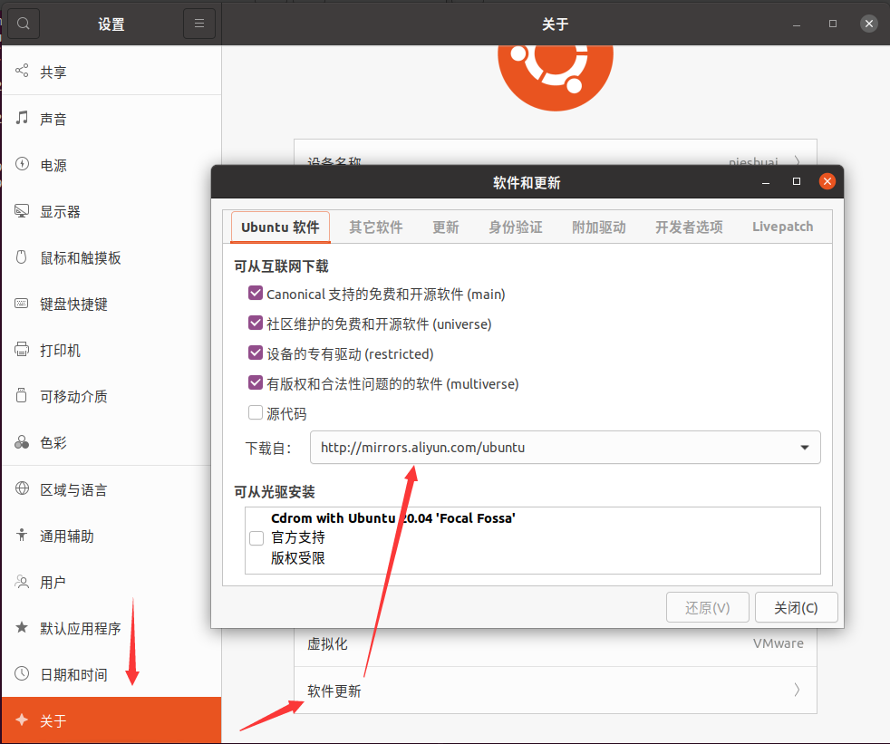
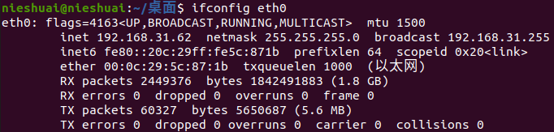
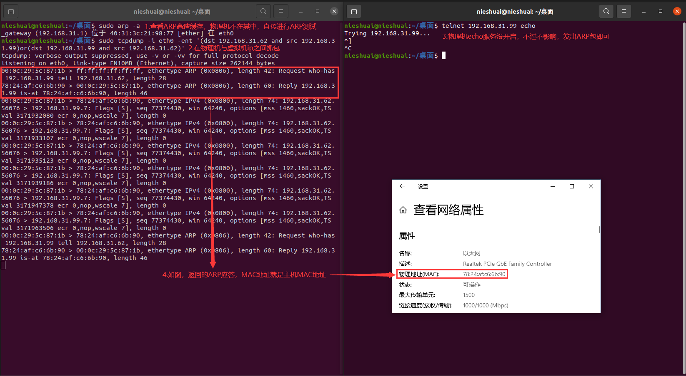
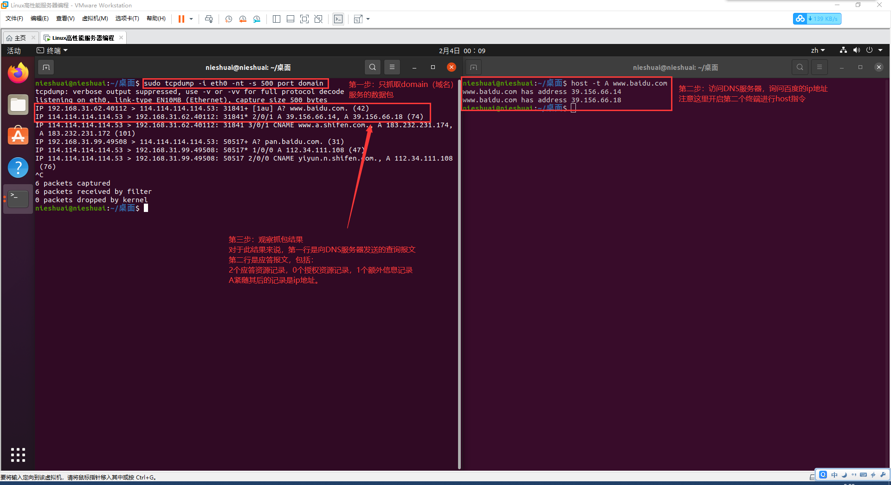

# 准备工作
___
## 环境
主机操作系统：windows 10 教育版
虚拟机：VMware Workstation Pro 15.5 PRO
虚拟机操作系统：ubuntu-20.04.1-desktop-amd64
## 虚拟机安装要点
* 安装ubuntu
过程中需要全程断网，安装完成后进入操作系统换源再更新软件
* 换源  

* 设置网卡名称
编辑修改文件`/etc/default/grup`,在`GRUB_CMDLINE_LINUX=" "` 的双引号内加入    `net.ifnames=0`保存退出。
然后输入`grub-mkconfig -o /boot/grub/grub.cfg`重建GRUB配置文件
* 设置静态ip
 20.04已经是利用`netplan`文件来设置ip地址，不是`network/interfaces`来设置了，具体配置如下
`vim /etc/netplan/01-network-manager-all.yaml`
```shell
# Let NetworkManager manage all devices on this system
network:
  version: 2
  renderer: NetworkManager
  ethernets:
    eth0:
      addresses: [192.168.31.62/24]
      gateway4: 192.168.31.1
      nameservers:
        addresses: [114.114.114.114]
```
注意netplan中各个参数有层级要求
正确的层数如下：
第一层－network:
第二层－－ ethernets:
第三层－－－ ens33:
第四层－－－－addresses:
第四层－－－－gateway4:
第四层－－－－nameservers:
第五层－－－－－addresses: 
最后重启网路服务`netplan apply`就正常了，最后`ifconfig`查看eth0进行检查。  

# 第一章
## P10 ARP抓包  

## P14 DNS抓包  

## P16 socket两点功能
* 将应用数据从用户缓冲区复制到TCP/UDP内核发送缓冲区，交付内核发送数据，或反之读取数据
* 修改内核中各层协议某些头部信息或其他数据结构，从而精细地控制底层行为