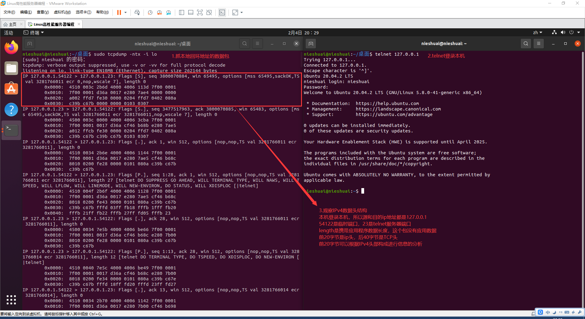
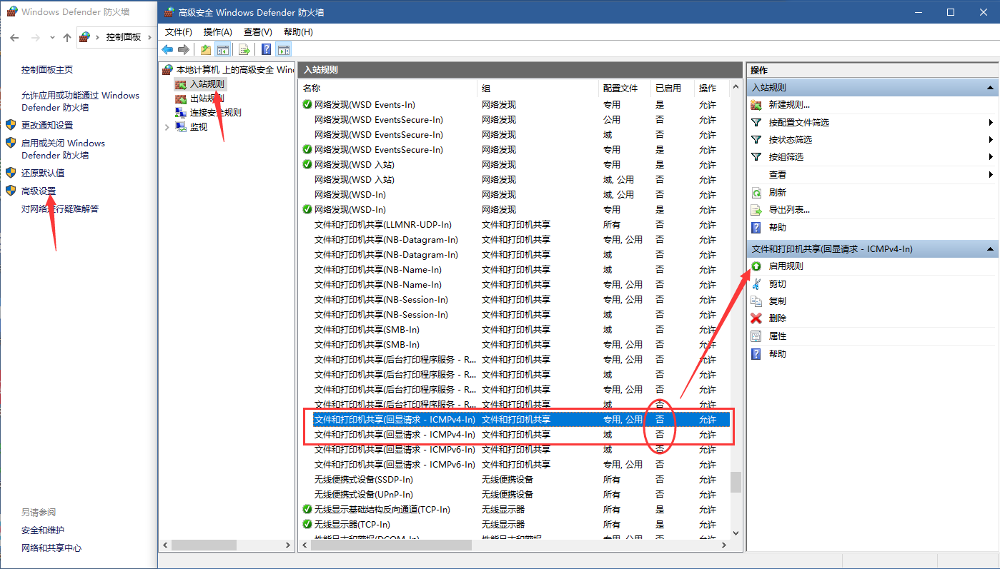
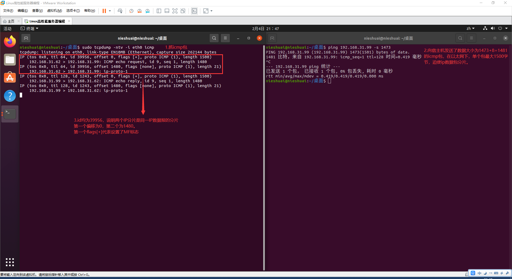
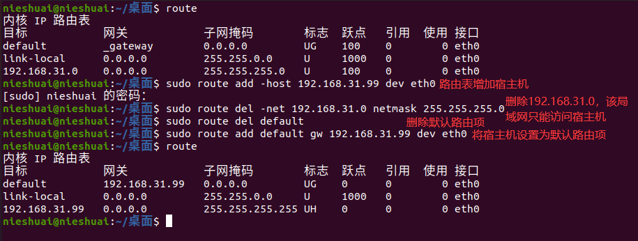
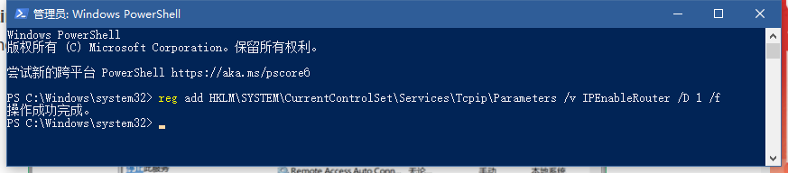
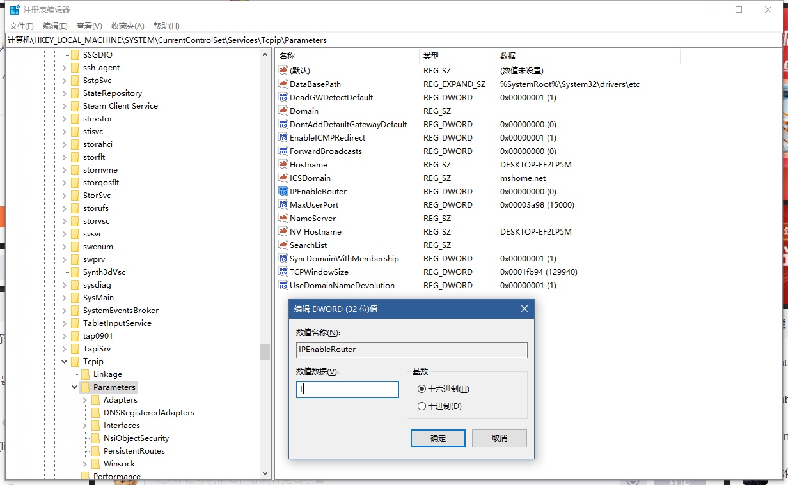
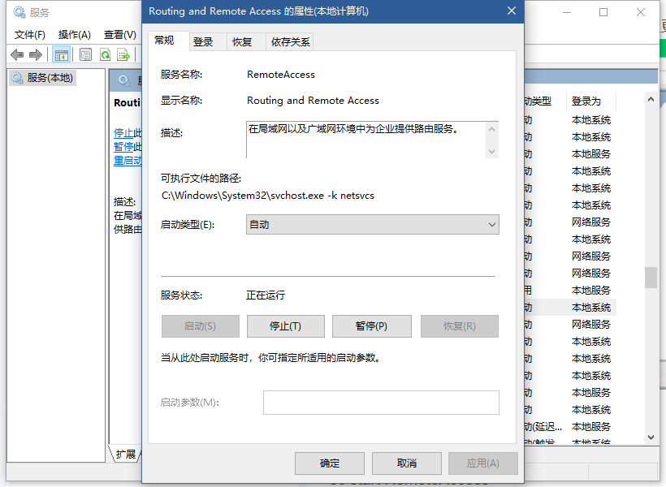

# 第二章
## IPv4头部结构
* 4位版本号：IPv4就是4
* 4位头部长度：有多少个4字节，4\*15=60故ip头最大为60字节
* 8位服务类型：其中4位TOS字段标记一位，分别是最小延迟，最大吞吐，最高可靠，最小费用
* 16位总长度：有多少个字节，最大2^16-1字节，可惜被MTU限制到1500字节，故分片
* 16位标识：随机生成，相同标识代表来自同一片
* 3位标志：第二位表示禁止分片，第三位表示是除了最后一个分片的分片
* 13位片偏移：偏移了多少8字节，该值\*8是数据部分的偏移量，故数据偏移量为8的倍数
* 8位生存时间：最大跳数，超出丢弃
* 8位协议：上层（传输层）协议
* 16位校验和：CRC，仅检验头部
* 32位源地址与32位目的地址：一般不变
* 变长可选信息，最多40字节
## P20 IPv4抓包
>本地回环地址
>127.0.0.1，通常被称为本地回环地址(Loopback Address)，不属于任何一个有类别地址类。它代表设备的本地虚拟接口，所以默认被看作是永远不会宕掉的接口。在Windows操作系统中也有相似的定义，所以通常在安装网卡前就可以ping通这个本地回环地址。一般都会用来检查本地网络协议、基本数据接口等是否正常的。  

>安装telnet
>一、安装openbsd-inetd软件包。
`sudo apt-get install openbsd-inetd -y`
二、安装telnetd服务。
`sudo apt-get install telnetd -y`
三、查看运行状态。
`sudo netstat -a | grep telnet`

  
## P22 icmp抓包
win10下被ping需要设置如下防火墙选项  
  
不然只能宿主机到虚拟机单向ping通，虚拟机ping不同宿主机  
  
## P24 路由机制
静态更行路由方式  
```shell
nieshuai@nieshuai:~/桌面$ sudo route add -host 192.168.31.99 dev eth0
nieshuai@nieshuai:~/桌面$ sudo route del -net 192.168.31.0 netmask 255.255.255.0
nieshuai@nieshuai:~/桌面$ sudo route del default
nieshuai@nieshuai:~/桌面$ sudo route add default gw 192.168.31.99 dev eth0
```
  
此时虚拟机是连不上网的  
下面，IP转发由于转发主机为win10宿主机，所以与书上不同，需要打开win10宿主机ip转发功能  
`reg add HKLM\SYSTEM\CurrentControlSet\Services\Tcpip\Parameters /v IPEnableRouter /D 1 /f`  
  
将注册表`HKEY_LOCAL_MACHINE\SYSTEM\CurrentControlSet\Services\Tcpip\Parameters\IPEnableRoute设为1`  
  
将 Routing and Remote Access 服务的启动类型更改为自动并启动服务  
  
现在在192.168.31.62上就可以通过192.168.31.99路由转发上网了  